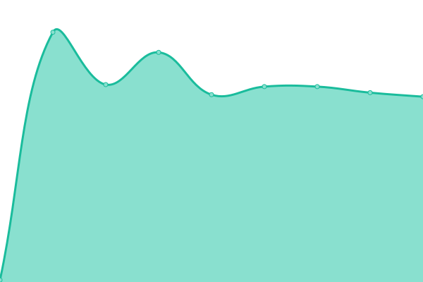

# [📈 Live Status](https://TheRedNet.github.io/stiftsupptime): <!--live status--> **🟧 Partial outage**

This repository contains the open-source uptime monitor and status page for [The_Red_Net](https://TheRedNet.github.io/stiftsupptime), powered by [Upptime](https://github.com/upptime/upptime).

With [Upptime](https://upptime.js.org), you can get your own unlimited and free uptime monitor and status page, powered entirely by a GitHub repository. We use [Issues](https://github.com/TheRedNet/stiftsupptime/issues) as incident reports, [Actions](https://github.com/TheRedNet/stiftsupptime/actions) as uptime monitors, and [Pages](https://TheRedNet.github.io/stiftsupptime) for the status page.

<!--start: status pages-->
<!-- This summary is generated by Upptime (https://github.com/upptime/upptime) -->
<!-- Do not edit this manually, your changes will be overwritten -->
<!-- prettier-ignore -->
| URL | Status | History | Response Time | Uptime |
| --- | ------ | ------- | ------------- | ------ |
|  [Homepage](https://stiftsgymnasium.de) | 🟩 Up | [homepage.yml](https://github.com/TheRedNet/stiftsupptime/commits/HEAD/history/homepage.yml) | 

 2028ms
     
 | 

<a href="https://TheRedNet.github.io/stiftsupptime/history/homepage">100.00%</a>
    

|  [Intranet](https://intranet.stifts.net) | 🟩 Up | [intranet.yml](https://github.com/TheRedNet/stiftsupptime/commits/HEAD/history/intranet.yml) | 

 937ms
     
 | 

<a href="https://TheRedNet.github.io/stiftsupptime/history/intranet">97.45%</a>
    

|  [WebMail](https://mail.stifts.net) | 🟩 Up | [web-mail.yml](https://github.com/TheRedNet/stiftsupptime/commits/HEAD/history/web-mail.yml) | 

 1682ms
     
 | 

<a href="https://TheRedNet.github.io/stiftsupptime/history/web-mail">99.61%</a>
    

|  [Support Sytem](https://support.stifts.net) | 🟩 Up | [support-sytem.yml](https://github.com/TheRedNet/stiftsupptime/commits/HEAD/history/support-sytem.yml) | 

 1253ms
     
 | 

<a href="https://TheRedNet.github.io/stiftsupptime/history/support-sytem">99.52%</a>
    

|  [Schule@BW Moodle](https://04104462160.moodle.bw.schule) | 🟥 Down | [schule-bw-moodle.yml](https://github.com/TheRedNet/stiftsupptime/commits/HEAD/history/schule-bw-moodle.yml) | 

 3272ms
     
 | 

<a href="https://TheRedNet.github.io/stiftsupptime/history/schule-bw-moodle">100.00%</a>
    

|  [WebUntis](https://cissa.webuntis.com/WebUntis/#/basic/login) | 🟩 Up | [web-untis.yml](https://github.com/TheRedNet/stiftsupptime/commits/HEAD/history/web-untis.yml) | 

 800ms
     
 | 

<a href="https://TheRedNet.github.io/stiftsupptime/history/web-untis">100.00%</a>
    

|  [MailXchange 1 (mx01.stifts.net)](mx01.stifts.net) | 🟩 Up | [mail-xchange-1-mx01-stifts-net.yml](https://github.com/TheRedNet/stiftsupptime/commits/HEAD/history/mail-xchange-1-mx01-stifts-net.yml) | 

 126ms
     
 | 

<a href="https://TheRedNet.github.io/stiftsupptime/history/mail-xchange-1-mx01-stifts-net">99.46%</a>
    

|  [MailXchange 2 (mx02.stifts.net)](mx02.stifts.net) | 🟩 Up | [mail-xchange-2-mx02-stifts-net.yml](https://github.com/TheRedNet/stiftsupptime/commits/HEAD/history/mail-xchange-2-mx02-stifts-net.yml) | 

 120ms
     
 | 

<a href="https://TheRedNet.github.io/stiftsupptime/history/mail-xchange-2-mx02-stifts-net">78.83%</a>
    

|  [MailXchange 3 (relay.rzone.de)](relay.rzone.de) | 🟩 Up | [mail-xchange-3-relay-rzone-de.yml](https://github.com/TheRedNet/stiftsupptime/commits/HEAD/history/mail-xchange-3-relay-rzone-de.yml) | 

 114ms
     
 | 

<a href="https://TheRedNet.github.io/stiftsupptime/history/mail-xchange-3-relay-rzone-de">100.00%</a>
    

<!--end: status pages-->

[**Visit our status website →**](https://TheRedNet.github.io/stiftsupptime)

## 📄 License

- Powered by: [Upptime](https://github.com/upptime/upptime)
- Code: [MIT](./LICENSE) © [Anand Chowdhary](https://anandchowdhary.com), supported by [Pabio](https://pabio.com)
- Data in the `./history` directory: [Open Database License](https://opendatacommons.org/licenses/odbl/1-0/)
